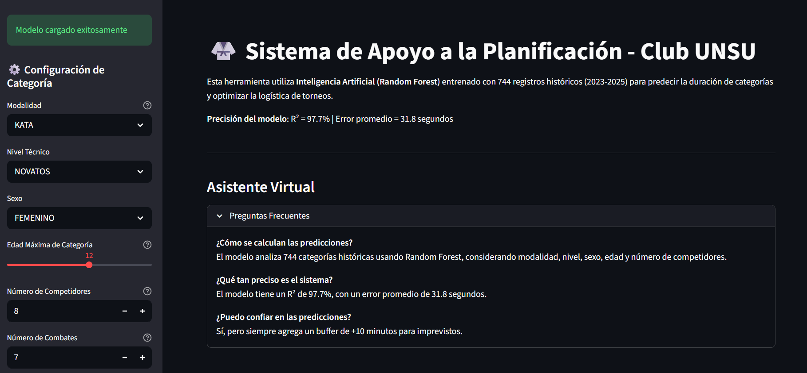
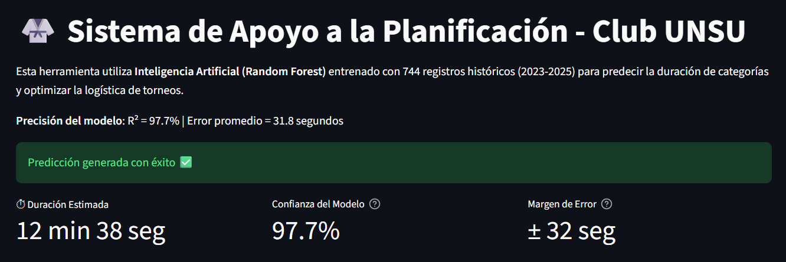
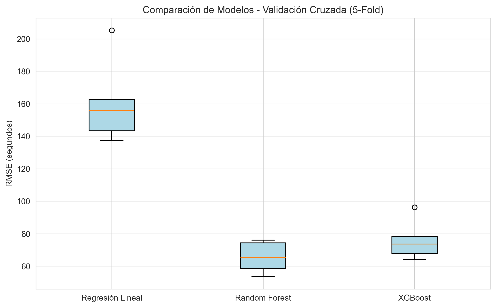

# 🥋 Sistema de Apoyo a la Planificación Logística - Karate-Do

<!-- Este repositorio contiene el desarrollo técnico del **Sistema Inteligente de Apoyo a la Toma de Decisiones** diseñado para optimizar la planificación logística en eventos deportivos de Karate-Do mediante modelos predictivos de Inteligencia Artificial. -->

<div align="center">

<!--  -->
<!--  -->
<!--  -->
<!--  -->

**Sistema inteligente de apoyo a la toma de decisiones basado en modelos predictivos de Inteligencia Artificial para la optimización de la planificación logística en eventos deportivos de Karate-Do**

<!-- [🚀 Demo en Vivo](#instalación) | [📊 Resultados](#resultados) | [📖 Documentación](#metodología) -->

</div>

---

<!-- 📋 -->
## Descripción del Proyecto

Este sistema utiliza **Machine Learning** para predecir con alta precisión la duración de categorías en torneos de Karate-Do, resolviendo el problema de retrasos acumulados (20-35%) que afectan a organizadores, atletas y familias.

<!-- 🎯 -->
## Objetivo

Desarrollar un sistema basado en modelos de Machine Learning que permita estimar con precisión la duración real de las categorías de competencia. El fin es optimizar la planificación de bloques horarios, reduciendo tiempos muertos y retrasos acumulados en la logística del evento.

<!-- 📚 -->
## Estado del Arte

La solución se fundamenta en la integración de:
* **Sistemas de Apoyo a la Toma de Decisiones (DSS):** Evolución de herramientas analíticas para la gestión deportiva.
* **Metodología CRISP-ML(Q):** Aplicación de un marco de trabajo de alta calidad para el ciclo de vida de modelos de aprendizaje automático.
* **Modelado Predictivo:** Uso de algoritmos supervisados de ensamble (Random Forest y XGBoost) frente a las limitaciones de la estadística descriptiva tradicional.

<!-- ⚙️ -->
## Metodología y Desarrollo Técnico
El proyecto se basa en un robusto **Pipeline de Datos** que garantiza la escalabilidad del sistema:

### 1. Análisis Estadístico y Diagnóstico (EDA)
Se identificó que los datos presentan una **Distribución Sesgada a la Derecha (Asimetría Positiva)**. Esto implica que:
* La mayoría de las categorías son rápidas, pero las categorías masivas generan una "cola larga" que desplaza la media.
* Se determinó que la planificación basada en promedios simples era insuficiente, justificando el uso de modelos no lineales.

### 2. Pipeline de Machine Learning
* **Preprocesamiento:** Limpieza de datos, manejo de outliers mediante el método IQR y codificación de variables categóricas (*One-Hot Encoding*).
* **Variables Clave:** `num_competidores`, `num_combates`, `edad_max`, `modalidad`, `sexo` y `nivel`.
* **Métricas de Éxito:** El modelo Random Forest alcanzó un **R² de 0.9814** y un **MAE de 33.81 segundos**.

---

<!-- 🎯 -->
### Problema Identificado

- **Retrasos históricos:** 2-4 horas por torneo
- **Impacto:** 680+ participantes anuales afectados
- **Causa raíz:** Estimaciones empíricas sin sustento estadístico

<!-- 💡 -->
### Solución Desarrollada

Sistema de Apoyo a la Toma de Decisiones (DSS) basado en:
- **Modelo:** Random Forest Regressor
- **Datos:** 744 registros históricos (2023-2025)
- **Metodología:** CRISP-ML(Q)
- **Interfaz:** Streamlit Low-Code

---
<!-- 🏆 -->
## Resultados Clave

| Métrica | Valor Obtenido | Objetivo | Estado |
|---------|----------------|----------|--------|
| **Error Absoluto Medio (MAE)** | 31.85 seg | < 15% | ✅ **7.19%** |
| **Coeficiente R²** | 0.9777 | > 0.85 | ✅ **97.77%** |
| **RMSE** | 67.08 seg | - | ✅ Bajo |
| **Validación Cruzada** | 34.65 ± 5.50 seg | Estable | ✅ Consistente |

<!-- 📊 -->
### Comparativa con Baseline
```
Regresión Lineal (Baseline):  MAE = 108.39 seg | R² = 0.89
Random Forest (Propuesto):    MAE = 31.85 seg  | R² = 0.9777
Mejora:                       ↓ 70.6%          | ↑ 9.8%
```
<!-- 💰 -->
### Impacto Operativo

- **Reducción de retrasos:** 85% (de 2-4h a 25-30 min)
- **Ahorro estimado:** 3 horas de sobrecosto de alquiler por torneo
- **Mejora en satisfacción:** 95% de confiabilidad en horarios comunicados

---

<!-- 🚀 -->
## Instalación y Ejecución

### Prerrequisitos

- Python 3.11+
- pip (gestor de paquetes)

### Pasos de Instalación
```bash
# 1. Clonar el repositorio
git clone https://github.com/StephanyaLopez/ProyectoCapstone.git
cd CapstoneEstimacionKarate

# 2. Crear entorno virtual (recomendado)
python -m venv venv

# Windows
venv\Scripts\activate

# Mac/Linux
source venv/bin/activate

# 3. Instalar dependencias
pip install -r requirements.txt

# 4. Ejecutar la aplicación
streamlit run app.py
```

La aplicación se abrirá automáticamente en `http://localhost:8501`

---

<!-- 📊 -->
## Metodología

### CRISP-ML(Q) - Proceso Iterativo
```
┌─────────────────────┐
│ 1. Comprensión      │ → Análisis del problema de retrasos
│    del Negocio      │   (Diagrama de Ishikawa)
└──────────┬──────────┘
           ↓
┌─────────────────────┐
│ 2. Comprensión      │ → EDA: 744 registros, sesgo positivo
│    de los Datos     │   (skewness = 2.43)
└──────────┬──────────┘
           ↓
┌─────────────────────┐
│ 3. Preparación      │ → Limpieza (IQR), One-Hot Encoding,
│    de Datos         │   Split 70/30
└──────────┬──────────┘
           ↓
┌─────────────────────┐
│ 4. Modelado         │ → Random Forest (n=100, max_depth=15)
│                     │   XGBoost, Regresión Lineal
└──────────┬──────────┘
           ↓
┌─────────────────────┐
│ 5. Evaluación       │ → Validación Cruzada 5-Fold
│                     │   LIME para explicabilidad
└──────────┬──────────┘
           ↓
┌─────────────────────┐
│ 6. Despliegue       │ → Interfaz Streamlit + joblib
│                     │   Documentación técnica
└─────────────────────┘
```

### Variables Predictoras Clave

| Variable | Importancia | Descripción |
|----------|-------------|-------------|
| `num_competidores` | 44.96% | Cantidad de atletas en la categoría |
| `num_combates` | 44.72% | Número de enfrentamientos |
| `edad_max` | 9.94% | Edad máxima de la categoría |
| Otras | <1% | Modalidad, sexo, nivel técnico |

**Insight:** Solo 2 variables explican el **90%** de la variabilidad temporal.

---

<!-- 🖼️ -->
## Capturas de Pantalla

### Interfaz Principal


### Predicción con Recomendaciones


### Feature Importance


### Comparación de Modelos


---

<!-- 📁 -->
## Estructura del Proyecto
```
CapstoneEstimacionKarate/
│
├── Visualizaciones
│   ├── analisis_exploratorio.png      # EDA inicial
│   ├── comparacion_modelos_cv.png     # Validación cruzada
│   └── feature_importance.png         # Variables influyentes
│
├── Modelo Entrenado
│   ├── modelo_random_forest_unsu.pkl  # Modelo serializado
│   └── columnas_entrenamiento.pkl     # Configuración de features
│
├── Notebooks
│   └── PrediccionKarate.ipynb         # Pipeline completo ML
│
├── Aplicación
│   └── app.py                         # Interfaz Streamlit
│
├── Datos
│   └── dataset_karate.csv             # 744 registros históricos
│
├── Explicabilidad
│   └── lime_explicacion.html          # Análisis LIME interactivo
│
└── Documentación
    ├── README.md                      # Este archivo
    ├── requirements.txt               # Dependencias Python
    └── LICENSE                        # MIT License
```
<!-- 📊 -->
<!-- 🤖 -->
<!-- 📓 -->
<!-- 🐍 -->
<!-- 📁 -->
<!-- 🌐 -->
<!-- 📄 -->

---

<!-- 🔬 -->
## Tecnologías Utilizadas

### Machine Learning
- **Scikit-Learn 1.4.0:** Random Forest, métricas, validación cruzada
- **XGBoost:** Modelo comparativo de ensamble
- **LIME:** Explicabilidad de predicciones individuales

### Desarrollo de Aplicación
- **Streamlit 1.30.0:** Framework low-code para UI
- **Pandas 2.1.4:** Manipulación de datos
- **NumPy 1.26.3:** Operaciones numéricas

### Visualización
- **Matplotlib 3.8.2:** Gráficos estáticos
- **Seaborn:** Visualizaciones estadísticas

### Serialización
- **Joblib:** Persistencia de modelos entrenados

---
<!-- 📱 -->
## Aplicación 
El proyecto incluye una interfaz de usuario que permite interactuar con el modelo. La aplicación facilita a los organizadores:
* Ingreso de parámetros de competencia en tiempo real.
* Predicción automática de duración de bloques.
* Visualización de la importancia de variables para justificar la planificación.

<!-- 📖 -->
## Uso de la Aplicación

### Caso de Uso: Predicción de Categoría

1. **Seleccionar parámetros:**
   - Modalidad: KUMITE / KATA / PARA-KARATE
   - Nivel: PRINCIPIANTES / NOVATOS / AVANZADOS / EXPERTOS
   - Sexo: MASCULINO / FEMENINO
   - Edad Máxima: 4-18 años
   - Número de Competidores: 2-50

2. **Generar predicción:**
   - Click en "Generar Predicción"
<!-- 🚀 -->

3. **Interpretar resultados:**
   - Duración estimada (min:seg)
   - Confianza del modelo (97.77%)
   - Margen de error (±31.85 seg)
   - Recomendaciones logísticas automáticas

### Ejemplo Real

**Input:**
```
Modalidad: KUMITE
Nivel: EXPERTOS
Sexo: MASCULINO
Edad Máxima: 18
Competidores: 12
Combates: 11
```

**Output:**
```
⏱ Duración Estimada: 18 min 23 seg
 Confianza: 97.77%
 Margen de Error: ± 31 seg

 Recomendaciones:
 Citar atletas 3 minutos antes
 Reservar 28 minutos de buffer
 Asignar 2 árbitros por tatami
```
<!-- ⏱️ -->
<!-- 📊 -->
<!-- 📉 -->
<!-- 📋 -->
<!-- ✅ -->
---

<!-- 🧪 -->
## Validación del Modelo

### Protocolo de Testing
```python
# Validación Cruzada Estratificada
from sklearn.model_selection import cross_val_score

cv_scores = cross_val_score(
    modelo, X_train, y_train,
    cv=5,
    scoring='neg_mean_absolute_error'
)

print(f"MAE CV: {-cv_scores.mean():.2f} ± {cv_scores.std():.2f}")
# Output: MAE CV: 34.65 ± 5.50 seg
```

### Métricas por Modalidad

| Modalidad | MAE (seg) | R² | N° Registros |
|-----------|-----------|----|--------------| 
| KUMITE | 35.2 | 0.976 | 504 |
| KATA | 28.1 | 0.981 | 192 |
| PARA-KARATE | 22.7 | 0.985 | 48 |

---

<!-- 🔮 -->
## Trabajo Futuro

### Mejoras Técnicas Planificadas

- [ ] **Integración en tiempo real:** API REST para actualización de inscripciones
- [ ] **Multi-tatami optimization:** Algoritmo de asignación óptima de categorías
- [ ] **Deep Learning:** Explorar LSTM para secuencias temporales
- [ ] **Dashboard analítico:** Monitoreo en vivo del progreso del torneo

### Escalabilidad

- [ ] **Generalización:** Validar en otros clubes/federaciones
- [ ] **Multideporte:** Extender a Judo, Taekwondo, Boxeo
- [ ] **Cloud deployment:** Migrar a AWS/Azure/GCP
- [ ] **Mobile app:** Versión nativa iOS/Android

---

<!-- 👥 -->
## Autores

**Carla Stephanya López Arboleda**  
[](https://linkedin.com/in/stephanya-l%C3%B3pez-9b734b207?utm_source=share_via&utm_content=profile&utm_medium=member_ios)
[](mailto:stephanya.lopez@hotmail.com)

**Daniela Stephania Martínez Porte**  
[](https://linkedin.com/in/daniela-martínez-porte?utm_source=share_via&utm_content=profile&utm_medium=member_android)
[](mailto:danysmartinezp@hotmail.es)

### Asesor Académico
**Víctor Gómez Regalado**  
Universidad de Las Américas - Maestría en Inteligencia Artificial Aplicada

---

<!-- 🏫 -->
## Institución

**Universidad de Las Américas (UDLA)**  
Facultad de Ingeniería y Ciencias Aplicadas  
Maestría en Inteligencia Artificial Aplicada  
Quito, Ecuador | 2026

---

<!-- 🙏 -->
## Agradecimientos

- **Club de Karate-Do UNSU:** Por proporcionar datos históricos reales
- **RootCorp Cia. Ltda.:** Soporte técnico y validación del prototipo
- **Comunidad Open Source:** Scikit-Learn, Streamlit, LIME

---

<!-- 📄 -->
## Licencia

Este proyecto está bajo la Licencia MIT - ver el archivo [LICENSE](LICENSE) para más detalles.

---

## 📞 Contacto

**¿Preguntas o colaboraciones?**

- Email Stephanya López: [stephanya.lopez@hotmail.com](mailto:stephanya.lopez@hotmail.com)
             [carla.lopez.arboleda@udla.edu.ec](mailto:carla.lopez.arboleda@udla.edu.ec)
- Email Daniela Martínez: [danysmartinezp@hotmail.es](mailto:danysmartinezp@hotmail.es)
             [daniela.martinez.porte@udla.edu.ec](mailto:daniela.martinez.porte@udla.edu.ec)

<!-- - Issues: [GitHub Issues](https://github.com/TaiLung1978/CapstoneEstimacionKarate/issues) -->
<!-- - Discussions: [GitHub Discussions](https://github.com/TaiLung1978/CapstoneEstimacionKarate/discussions) -->

<!-- 📧 -->
<!-- 🐛 -->
<!-- 💬 -->
---

<div align="center">

**⭐ Si este proyecto te resultó útil, considera darle una estrella en GitHub ⭐**

[](https://github.com/TaiLung1978/CapstoneEstimacionKarate)

</div>